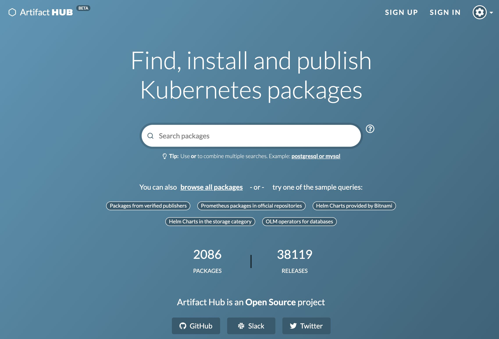

# Helm

## 什么是 Helm

Helm 是 [CNCF](https://cncf.io/) 的一个毕业项目，由 [Helm 社区](https://github.com/helm/community) 维护。

Helm 帮助你管理 Kubernetes 应用 — Helm Chart 帮助你定义、安装和升级最复杂的 Kubernetes 应用。Chart 易于创建、版本、共享和发布 — 所以开始使用 Helm 吧，停止复制和粘贴！

### 安装 Helm

用软件包管理器安装 Helm，或下载 [二进制文件](https://github.com/helm/helm/releases/latest)。



```bash
brew install helm
```



```bash
choco install kubernetes-helm
```



```
scoop install helm
```



```
gofish install helm
```



```
sudo snap install helm --classic
```



### Helm Chart 官方仓库

访问 [Artifact Hub](https://artifacthub.io/)，搜索众多公共资源库中的 [Helm Charts](https://artifacthub.io/packages/search?page=1&kind=0)。



## 快速上手 Helm 

### 使用 Helm 工具链安装并管理 K8s 应用

> 来源：海立 @ [ServiceUP](https://www.yuque.com/serviceup) &gt; [快速上手 Kubernetes ](https://www.yuque.com/serviceup/k8s-hands-on)

本文将介绍为何要使用 Helm 进行 Kubernetes 软件包管理，并通过一些示例展示如何使用 Helm 和 [Helmfile](https://github.com/roboll/helmfile) 部署和管理 Kubernetes 应用。 

### 告别手写，一键生成 Helm Chart README 文件 <a id="activity-name"></a>

> 来源：[郭旭东](https://github.com/sunny0826) @ 云原生之路 &gt; [云原生工具箱](https://mp.weixin.qq.com/mp/appmsgalbum?__biz=MzI4MzcwMTA5Nw==&action=getalbum&album_id=1416096301506314242&scene=173&from_msgid=2247483835&from_itemidx=1&count=3#wechat_redirect)

一个好的应用必定有一套好的文档，文档的质量往往和代码的质量成正比。而 Helm Chart 中的 `README.md` 文件就承担了文档的作用，该文件会介绍这个 Helm Chart 的基本信息、使用方式以及参数配置等，用户可以通过该文档的指引，配置符合自己需求的参数，最终完成云原生应用的部署。

但这也给云原生应用的开发者提出了挑战，开发者不但需要把 `value.yaml` 和 `Chart.yaml` 等文件的参数以 Markdown 的形式搬运到 `README.md` 文件中，同时还要将参数的默认值，以及介绍填入表格中。但如果参数出现了变动，往往无法及时更新文档。这就导致了用户明明根据文档配置了参数，但是部署的效果就是无法达到预期。

